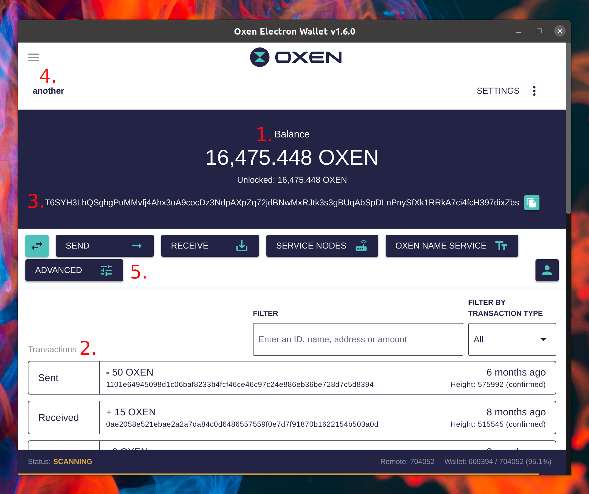
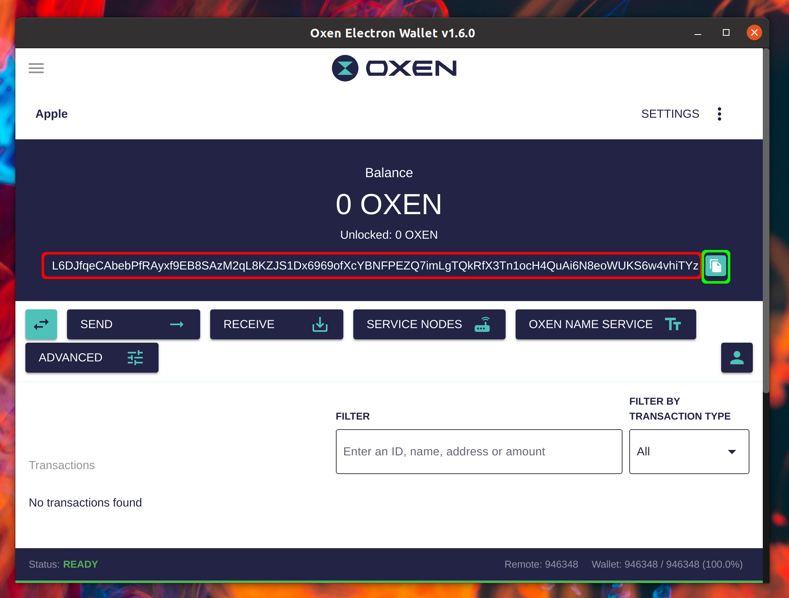
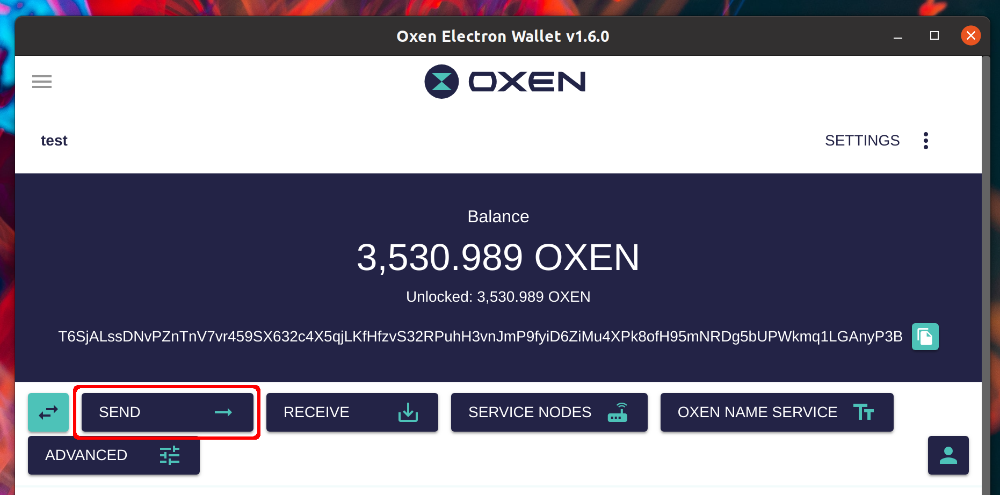

# GUI Wallet Quickstart

This guide will walk you through using the GUI wallet for the first time. It assumes you already have the GUI wallet installed and running. If this is not the case you can download the wallet from our [downloads page](../../downloads.md). Some overzealous antivirus software may take issue with the Oxen wallet, if this happens we walk you what to do about that [HERE](preparing-for-gui-wallet-setup-windows.md).

### **General Workflow of the GUI Wallet**

We will discuss in detail the process of creating & using the wallet later in this guide. But a quick overview of the GUI wallet is as follows. The wallet begins by displaying a list of your wallets and looks like this:

In this above image you can see 5 different wallets. Each wallet has a different address and holds a different amount of Oxen. Clicking on a wallet will ask you for a password which is used to decrypt the wallet file and brings you to the following page:

This is the main wallet page which contains all of the basic information about the wallet.

**1.** The “Total Balance” of the wallet is shown just above the centre of the screen (16,475.448 Oxen). It also lists the 'unlocked' balance directly below. If you have staked to an Oxen service node, the amount of Oxen you have staked will be unavailable to send.&#x20;

**2.** A list of sent and received transactions can be seen at the bottom. (Showing where you have previously received funds, and also previously spent funds)

**3.** The long alphanumeric text in the center is the wallet address (T6SYH3Lh…). In this image the wallet operates on the Oxen testnet (A network built to practice without risking real funds), this can be identified by the address beginning with the letter “T” and the address being 98 characters long. When interacting with the Oxen mainnet (The real network) the wallet address will begin with the letter “L” and will be 95 characters long.

**4.** The wallet name at the top left. This name is decided by you and matches with the names on the first page. This name is simply to help you identify which wallet you are using, if you have multiple wallets.

**5.** Action Buttons for wallet usage. These include sending funds, receiving funds, interacting with service nodes and purchasing and managing Oxen Name Service records (ONS Records). We will go into sending and receiving in detail later.

### Your first time opening the GUI wallet software, selecting the network and creating a new wallet.

When you first open up the GUI wallet you will need to create a wallet and setup some default settings.\
\
You will first be greeted with a language selection page. We will be walking through the English version here. Click your native language to continue to the next page:

The next page of the wallet is where you configure the network settings.

**Basic Network Settings**

To get started quickly and easily the following settings are recommended:

* **Type:** Remote Daemon Only
* **Remote Node Host:** public.loki.foundation
* **Remote Node Port:** 22023

**Additional Network Configuration Details**\
The three radio buttons at the top of this page determine how the wallet connects to your daemon (which manages the blockchain). Remote means there is an external daemon that the wallet communicates with. Local Daemon means the wallet will spin up a subprocess for the daemon and interact with it directly.

Running a local daemon will require syncing the Oxen blockchain before you are able to interact with the wallet, which will take time. So for an immediate start, connecting to a remote daemon that the Oxen Foundation is running is the easiest option.

The downside to using a third party for your remote daemon is that it is privacy reducing (That third party will see your requests to the network). So for ultimate security one should run their own daemon, but as that is a more advanced topic we won't get into it here. If you wish to follow this route it is recommended you run the oxend daemon software separately, wait for the blockchain to sync, and from the wallet select “Remote Daemon Only” and point it at your own local daemon (Remote Node Host: Localhost). This means you do not need to keep the wallet open while syncing and have greater control over the daemon rather than letting the wallet manage the daemon. If this sounds like mumbo jumbo to you, don't stress, just choose the basic network settings above and continue.

The next page will present 3 options to decide how to create/load/import/open a wallet into the application. If you have not used the GUI wallet before will want to choose “Create new wallet”

### Creating a new wallet

When creating a new wallet you will need to choose the following:

1. **Wallet Name:** represents the name of the datafile and is used throughout the application to identify the wallet. Choose something that is memorable because your wallet list can become unwieldy rather quickly when creating multiple wallets. For this reason using names such as: Wallet1, Wallet2, Wallet3 etc are not recommended.
2. **Seed language:** The most important part of the wallet creation process is the creation of your “Seed Phrase”. This is shown in the next step. Select your native language here to make the recording of your seed phrase easier.
3. **Password:** Your wallet file will be encrypted by this password to prevent malicious persons from accessing your wallet if they get control of the wallet file. Please note that you can still access your wallet if you forget the password but still have the seed phrase. A password is not necessary (resulting in an unencrypted wallet save file) but it is highly recommended.

After filling in the appropriate fields click “Create Wallet”

On this page you are shown the details of your newly created wallet. At the top you can see your new wallet address which is used by other persons to send funds to you. Beneath this you can see your seed words.

**Important!**

**Please note that these 25 seed words are by far the most important part of the wallet creation process. Write these somewhere safe! Don't lose them. If a malicious person gets access to these words they will be able to spend your funds. The Oxen team will NEVER ask you for your seed phrase and a person requesting them from you is likely a scammer trying to steal your funds.**

You won’t need to regularly use these seed words. But if/when you need to recover your wallet or move the wallet to a different computer then everything can be rebuilt using these 25 words.

Click “OPEN WALLET” and you will be brought to the main wallet page discussed earlier.

### Receiving funds for the first time

When purchasing oxen from an exchange or requesting funds from another person you will need to provide your wallet address. From the main page your wallet address is the 95 character text starting with “L”. This is shown in the red box below:

If you click the “Copy Address” button to the right of the address (Shown in the green box) your wallet address will be copied to the clipboard and you can simply paste it using Ctrl-V.

When receiving funds from an exchange there will generally be some processing time from the exchange (This time varies depending on the exchange) then a transfer will occur on the blockchain which your wallet will recognise.

The wallet scans the blockchain to find transfers that belong to you, when it finds one it will be added to the transaction list at the bottom and your balance will be updated. If the wallet is not detecting your transfers the most common reason is due to the wallet not being fully synced yet.

Down the bottom of the application there is a status bar. This should be green and say _Status: READY_

_Remote: 946353_ refers to the height of the blockchain on the remote daemon. _Wallet: 946353 / 946353 (100.0%)_ refers to how much of the blockchain the wallet has processed when looking for your transactions. The wallet has to scan all transactions on the blockchain when searching for your transactions, so this process does take some time. If the wallet is still syncing the status bar will look like this:

While _Status: SYNCING_ is in the status bar it is normal and expected that your transactions are not processed and therefore won't be shown in the application. Please wait until the wallet show _Status: READY_

Both the Remote Daemon and the Wallet need to be fully synced for your wallet to work correctly.

### Sending Funds

From the main page in the application click on the “Send” button

From here you will be greeted with the page to enter in your recipients address and the amount you wish to transfer. Key things to not note this page:

1. **Amount:** This is the amount of Oxen you wish to transfer, 1 means 1 full oxen transferred
2. **Priority:** Blink is our instant transfer technology which is selected by default. Selecting slow will mean the recipient has to wait until the transfer has been confirmed in a block before seeing the payment. Choosing Blink is recommended wherever possible.
3. **Address:** The address of the recipient.
4. **Notes:** This is an optional field for noting details about the transaction such as: why are you sending it, who are you sending it to etc. This is completely optional.

Click “Send” and you will be prompted for the wallet password and then a screen will confirm the transaction details.

Click Send to broadcast the transaction to the network. Shortly afterwards the bottom of the application will display a green banner saying _Transaction Successfully Sent_

After this point the transaction will show up in your transaction list and your balance will be reduced by the sent amount.&#x20;
